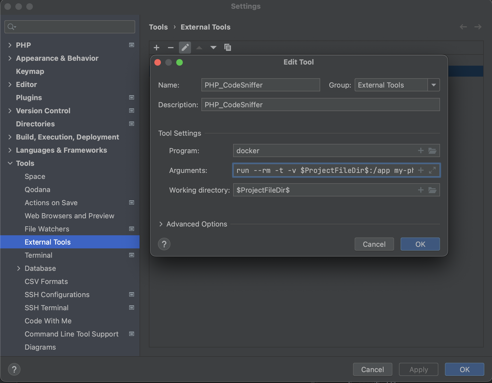
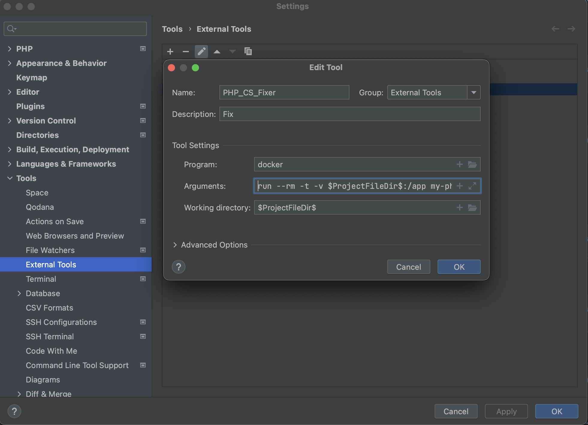
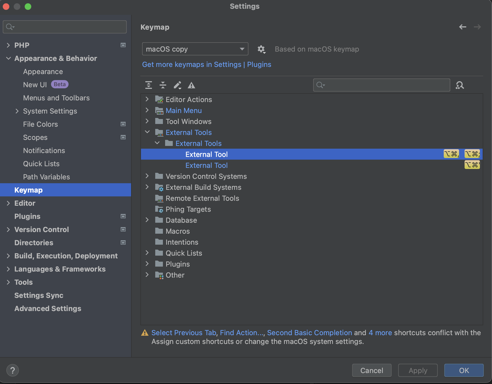
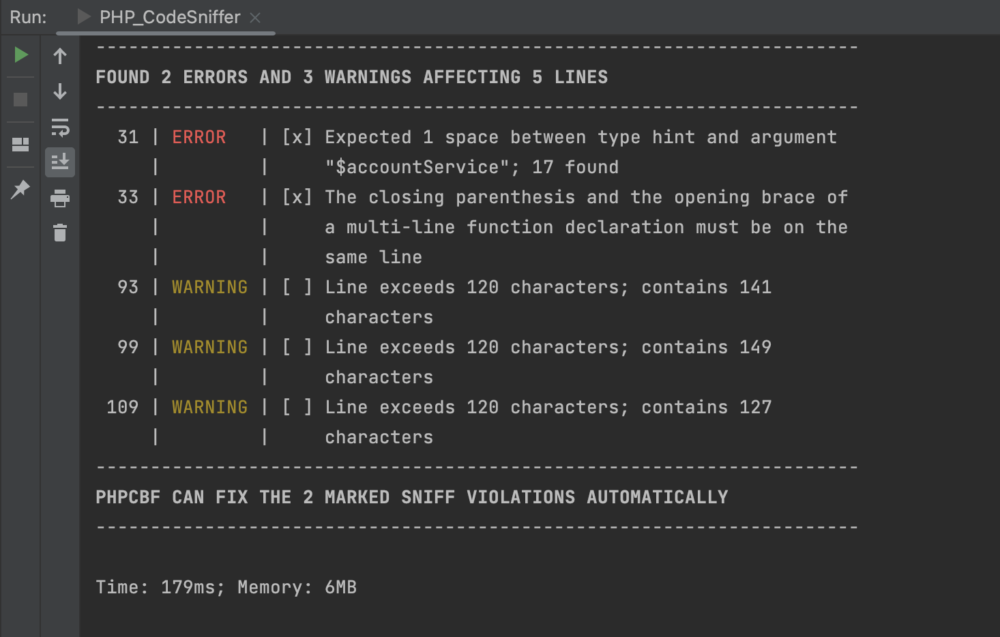
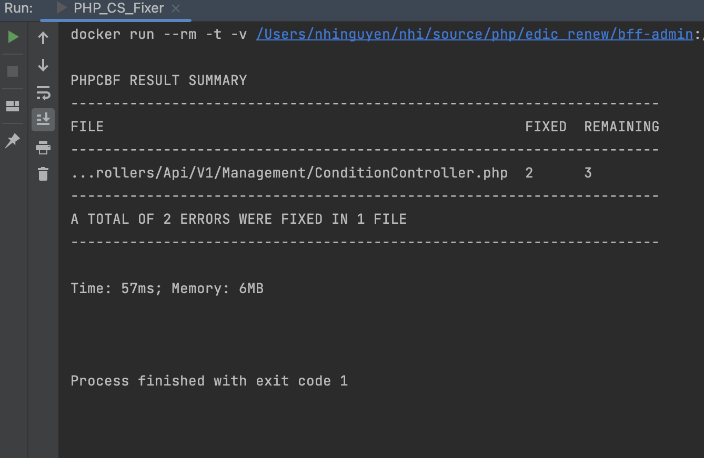

# PHP Code Sniffer with Docker
Hi bro ✨ This project will help you set up https://github.com/squizlabs/PHP_CodeSniffer with docker

## Project setup
```  
docker build -t my-phpcs-image .  
```  


*if you want to add more rule sets*
-   Add file {your_ruleset_name}.xml inside folder rules
- Edit DockerFile, add cmd

  ```   
  COPY ./rules/{your_ruleset_name}.xml /{your_ruleset_name}.xml
  ```  

- Rebuild docker image
  ```  
  docker build -t my-phpcs-image .  
  ```  

- to execute PHPCS or PHPCBF using customize rule set
  ```
  phpcs --standard=/{your_ruleset_name}.xml
  phpcbf --standard=/{your_ruleset_name}.xml  
  ```

## Run PHPCS or PHPCBF by command prompt
### PHPCS
- run on all file in project
  ```
    docker run --rm -v /{path/to/your/project}:/app my-phpcs-image phpcs --colors --standard=/phpcs.xml /app
  ```
- run on specified file
  ```
    docker run --rm -v /{path/to/your/project}:/app my-phpcs-image phpcs --colors --standard=/phpcs.xml /app/{your_file_relative_to_project_root}
  ```
  example:
  ```
    docker run --rm  -t -v /Users/projects/account:/app my-phpcs-image phpcs --colors --standard=/phpcs.xml /app/app/Http/Controllers/AccountController.php
  ```
### PHPCBF
- fix all file in project
  ```
    docker run --rm -v /{path/to/your/project}:/app my-phpcs-image phpcbf --standard=/phpcs.xml /app
  ```
- fix specified file
  ```
    docker run --rm -v /{path/to/your/project}:/app my-phpcs-image phpcbf --standard=/phpcs.xml /app/{your_file_relative_to_project_root}
  ```
  example:
  ```
    docker run --rm  -t -v /Users/projects/account:/app my-phpcs-image phpcbf --standard=/phpcs.xml /app/app/Http/Controllers/AccountController.php
  ```
To read more usage, visit: https://github.com/squizlabs/PHP_CodeSniffer/wiki/Usage

## Set up PHPCS with PHPSTORM
### PHPCS
1. Open PhpStorm and go to "Preferences" (on macOS) or "Settings" (on Windows/Linux).
2. In the left sidebar, navigate to "Tools" -> "External Tools".
3. Click on the "+" button to add a new external tool.
4. Provide a name for the tool (e.g., "PHP_CodeSniffer").
5. Set the "Program" field to the path of the docker executable. This will typically be /usr/bin/docker on Linux or /usr/local/bin/docker on macOS.
6. Enter the following arguments in the "Arguments" field:
  ```
    run --rm -t -v $ProjectFileDir$:/app my-phpcs-image phpcs --colors /app/$FilePathRelativeToProjectRoot$ --standard=/phpcs.xml 
  ```




### PHPCBF
1. Open PhpStorm and go to "Preferences" (on macOS) or "Settings" (on Windows/Linux).
2. In the left sidebar, navigate to "Tools" -> "External Tools".
3. Click on the "+" button to add a new external tool.
4. Provide a name for the tool (e.g., "PHP_CS_Fixer").
5. Set the "Program" field to the path of the docker executable. This will typically be /usr/bin/docker on Linux or /usr/local/bin/docker on macOS.
6. Enter the following arguments in the "Arguments" field:
  ```
    run --rm -t -v $ProjectFileDir$:/app my-phpcs-image phpcbf /app/$FilePathRelativeToProjectRoot$ --standard=/phpcs.xml 
  ```



### Setup keyboard shortcut for external tool in PhpStorm

1. Open PhpStorm and go to "Preferences" (on macOS) or "Settings" (on Windows/Linux).
2. In the left sidebar, navigate to "Keymap".
3. In the Keymap settings, expand the "External Tools" section.
4. Locate your custom external tool in the list. It should have the name you provided when you created it.
5. Right-click on your external tool and select "Add Keyboard Shortcut".
6. In the dialog that appears, press the desired key combination for your shortcut. Make sure it doesn't conflict with any existing shortcuts.
7. Click "OK" to save the keyboard shortcut.
8. Then chill with your phpcs by using shortcut with any project in PHPSTORM



## Result
To check a file against the PRS2 coding standard, simply specify the file's location.


To fix a file format with  PRS2 coding standard, simply specify the file's location.


## Special Thanks

I would like to express my sincere gratitude to everyone who contributed to this project. Thank you for your valuable contributions and support. 🙏

## Good Luck! 🍀

To all the users and contributors, I wish you the best of luck in your endeavors. May this project bring you success, fulfillment, and joy. Keep up the great work! 💪

Happy coding! 💻
